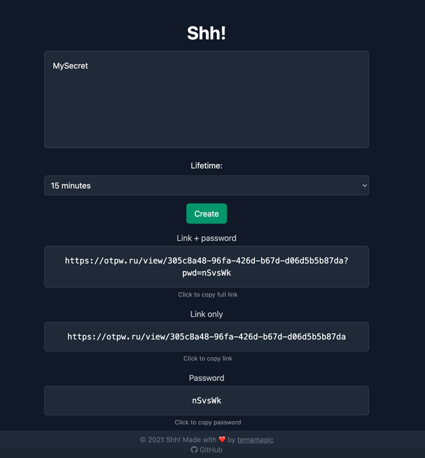

[](https://goreportcard.com/report/github.com/onetimepw/onetimepw)
[](https://opensource.org/licenses/MIT)




# OneTimePW

OneTimePW is an easy-to-use self-hosted service for secure password and other sensitive information sharing.

# Why do I need OneTimePW?

When you share sensitive information like passwords via email or chat, it is stored as is in the recipient's mailbox or chat history.
This poses a security risk.

OneTimePW solves this problem by allowing you to share sensitive information securely.
The information is encrypted and deleted after it is viewed once.

The recipient receives a link to the information, which can be viewed only once.
After the information is viewed, it is deleted from memory.

That's it! No more worrying about sensitive information being stored in email or chat history.

## Demo

You can try out OneTimePW at <https://otpw.ru>

### How can I verify that the server is the same version as on GitHub?

You can check the version of the server by sending a GET request to the `/health/check` endpoint.

```bash
{
  "release": "11154621569",
  "results": [
    {
      "checker": "service",
      "status": true
    },
    {
      "checker": "redis",
      "status": true
    }
  ],
  "status": "ok",
  "uptime": 2418,
  "version": "bd4d0da538ade40a9450defbeb394d6aa910a507"
}
```

The `version` field contains the commit hash, `release` contains the workflow run id, ex from above:
<https://github.com/onetimepw/onetimepw/actions/runs/11154621569>
<https://github.com/onetimepw/onetimepw/commit/bd4d0da538ade40a9450defbeb394d6aa910a507>


## 🔧 How to Install

### 🚀 Quick Start with Docker
```bash
docker run -d --name otpw --restart=always -p 127.0.0.1:8080:8080 ghcr.io/onetimepw/onetimepw:latest
```

OneTimePW is now running on http://127.0.0.1:8080

Now you can set up a reverse proxy like Nginx/Caddy/Traefik to serve the application over HTTPS.

### 🐳 Docker compose

You can also use docker-compose to run OneTimePW (with or without redis).
<details open>
<summary>Example with redis</summary>

docker-compose.yml:
```yaml
services:
  redis:
    image: redis:6.2
    restart: always
    ports:
      - 127.0.0.1:6379:6379
    volumes:
      - ./redis_data:/data
    command: redis-server --requirepass ${REDIS_PASSWORD}
    healthcheck:
      test: [ "CMD", "redis-cli", "ping" ]
      interval: 10s
      timeout: 2s
      retries: 5

  app:
    image: ghcr.io/onetimepw/onetimepw:master
    restart: always
    stop_signal: SIGINT
    depends_on:
      - redis
    environment: # You can set environment variables here
      - REDIS_ADDR=redis://:${REDIS_PASSWORD}@redis:6379
      - PORT=8080
      - NAME_SPACE=onetimesecret
      - MEMORY_CAPACITY=10000 # for in memory cache, set capacity equal to 10000 elements
# Alternatively, you can use a config file
#    volumes:
#      - ./otwp.config.yml:/app/config.yml
    ports:
      - 127.0.0.1:8080:8080
    logging:
      driver: "json-file"
      options:
        max-size: "10m"
        max-file: "20"

volumes:
  redis_data:
```
</details>

#### Configuration

You can also configure the application using environment variables or a config file.

<details>
<summary>otwp.config.yml:</summary>

```yaml
env: "prod"
port: 8080
redis_addr: "redis://:someRedisPass@localhost:6379"
name_space: "onetimesecret"
memory_capacity: 10000 # for in memory cache, set capacity equal to 10000 elements
```
</details>

## Motivation
- I was looking for a self-hosted service to securely share sensitive information, but I couldn't find one that was easy to use and looked simple. I found a few services that did this, but they were either too complicated to set up or didn't appeal to me (and they were written in Ruby)
- Try to deploy with github actions
- Why not?

If you love this project, please consider giving it a ⭐.

## Contributions

### Bug Reports / Feature Requests

If you want to report a bug or request a new feature, feel free to open a [new issue](https://github.com/onetimepw/onetimepw/issues/new).

### Pull Requests

If you want to help us improve OneTimePW (especially if you are good with frontend, cuz i'm not), feel free to open a [pull request](https://github.com/onetimepw/onetimepw/pulls).
